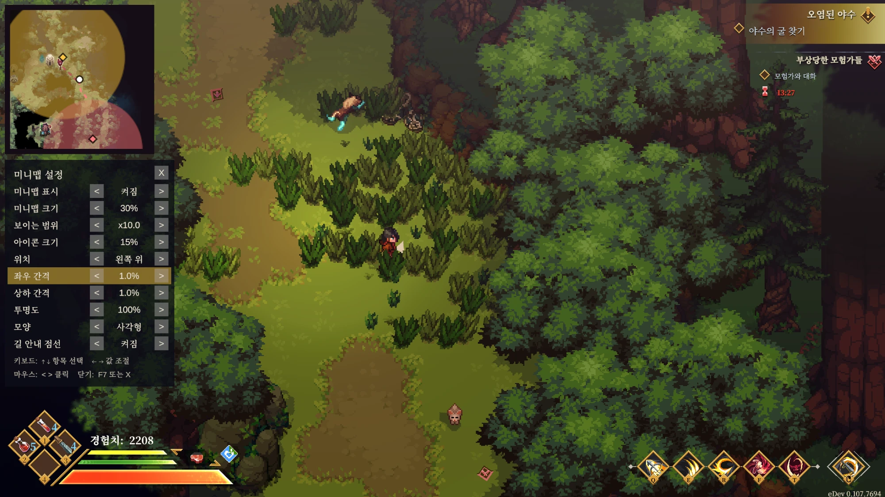

# Dimraeth Minimap

[English](README.md) | **한국어**

[Dimraeth](https://store.steampowered.com/app/2402680/Dimraeth/)에 미니맵을 추가하는 **비공식** BepInEx 플러그인입니다.

> **안내 / Notice**
> 이 모드는 팬이 만든 비공식 모드이며 개발사 Mudtek과 아무 관련이 없습니다. 게임 파일이나 게임에서 추출한 데이터는 저장소와 릴리스에 포함하지 않습니다. **개발사가 요청하면 즉시 배포를 중단하고 저장소를 내리겠습니다.** 사용에 따른 책임은 사용자에게 있습니다.
>
> This is an unofficial fan-made mod, not affiliated with or endorsed by Mudtek. No game files or game-derived data are included in this repository or its releases. **It will be taken down immediately at the developer's request** — please open an issue. Use at your own risk.



*미니맵(왼쪽 위)에 주변 지도, 안개, 장소 아이콘이 표시된 모습과 그 아래의 F7 설정 창.*

## 기능

- 화면 구석에 원형(또는 사각) 미니맵 표시, 확대/축소
- **게임 안 설정 창(F7)**: 미니맵 크기, 보이는 범위, 아이콘 크기, 위치, 간격, 투명도, 모양을 바로 조절. 한국어 / 영어 지원
- 게임의 월드 지도를 그대로 잘라 보여 주는 방식이라 **프레임 비용이 거의 없습니다**
- **안개(미발견 지역)는 그대로 가려집니다.** 게임이 숨긴 정보를 드러내지 않습니다
- 지도 화면과 같은 아이콘 표시: 발견한 장소(웨이포인트, 상점, 야영지 등), 퀘스트/대화 NPC, 지도 조각(획득한 것은 회색), 보상 지점, 내가/파티가 찍은 표식
- 추적 중인 퀘스트의 목표(다이아몬드 + 범위 원)와 **길 안내 점선**. 멀리 있는 목표와 표식은 테두리에 방향으로 표시
- 게임이 지도 화면이나 HUD에서 이미 보여 주는 정보만 표시합니다. 몬스터, 숨겨진 상자, 미발견 장소는 표시하지 않습니다
- 같은 지역의 다른 플레이어를 점으로 표시 (범위 밖이면 테두리에 방향 표시)
- **클라이언트 전용**: 내 화면에만 그리며 게임 상태나 네트워크에는 손대지 않습니다. 모드가 없는 사람과 같이 플레이해도 됩니다
- 게임 업데이트로 내부 구조가 바뀌면 게임을 멈추지 않고 미니맵만 꺼집니다

## 설치 (플레이어용)

1. [Releases](../../releases/latest)에서 `DimraethMinimap-vX.Y.Z.zip`을 받아 아무 곳에나 풉니다.
2. 게임을 끄고 `install.bat`을 더블클릭합니다. Steam에서 게임 위치를 자동으로 찾아 설치합니다 (다른 드라이브여도 됩니다). 못 찾으면 폴더를 물어봅니다.
3. 게임을 실행합니다. 첫 실행은 1~3분 걸립니다.

업데이트도 새 zip으로 같은 과정을 반복하면 됩니다 (설정 유지). 제거는 게임 폴더의 `uninstall-minimap.bat`을 실행하면 됩니다. 수동 설치를 원하면 zip 안 `payload` 폴더의 내용물을 게임 폴더에 복사하세요.

| 키 | 동작 |
|---|---|
| F7 | **설정 창** 열기/닫기. 키보드(↑↓ 항목 선택, ←→ 값 조절) 또는 마우스(`<` `>` 클릭)로 조절, 닫을 때 저장 |
| F8 | 미니맵 켜기/끄기 |
| PageUp / PageDown | 확대 / 축소 |
| F9 | 진단 정보를 `BepInEx/LogOutput.log`에 기록 |

설정 파일: `BepInEx/config/com.yhj.dimraeth.minimap.cfg` (위치, 크기, 모양, 투명도, 단축키, `[Markers]`에서 아이콘 종류별 켜기/끄기와 크기)

퀘스트 범위 안에 들어가 있는 동안에도 범위 원과 핀은 유지되며, 퀘스트를 끝내거나 범위를 벗어나면 사라집니다.

## 빌드 (개발용)

필요한 것: .NET SDK 8 이상, BepInEx 6 (IL2CPP)을 설치하고 **한 번 실행한** 게임.

```powershell
dotnet build src\DimraethMinimap -c Release -p:GameDir="D:\SteamLibrary\steamapps\common\Dimraeth"
powershell -File tools\package.ps1 -GameDir "D:\SteamLibrary\steamapps\common\Dimraeth"
```

프로젝트는 게임 폴더의 `BepInEx\interop\*.dll`을 직접 참조합니다. 이 파일들은 게임 코드에서 생성된 것이므로 **저장소나 릴리스에 절대 포함하지 않습니다** (`.gitignore`와 `package.ps1`의 검사로 막아 둠). 같은 이유로 CI 빌드는 하지 않고 로컬에서 빌드해 릴리스에 올립니다.

## 구조

| 파일 | 역할 |
|---|---|
| `Plugin.cs` | 진입점, 설정 항목 |
| `MinimapController.cs` | 미니맵 UI. 지도 모드(기본)와 카메라 모드(대체) |
| `GameAccess.cs` | 플레이어 위치 읽기. 네트워크 목록 조회만 사용 (씬 전체 검색 금지 - 이 게임에서는 심한 끊김 유발) |
| `GameMap.cs` | 게임의 지도 데이터(좌표 변환, 발견 지역) 읽기 |
| `GameMarkers.cs` | 아이콘/퀘스트 목표/길 안내 경로 읽기. 게임이 이미 들고 있는 목록만 복사 |
| `SettingsPanel.cs` | F7 설정 창. 키보드와 마우스로 조작, 한국어 / 영어 |
| `Diagnostics.cs`, `FrameStats.cs` | F9 진단 로그, 프레임 걸림 측정 |

게임 클래스를 건드리는 곳은 `GameAccess.cs`, `GameMap.cs`, `GameMarkers.cs`뿐이며 모두 읽기 전용입니다. 게임 업데이트로 깨지면 해당 기능만 꺼집니다.

## 라이선스

MIT. 릴리스 zip에는 [BepInEx](https://github.com/BepInEx/BepInEx) (LGPL-2.1)가 수정 없이 포함됩니다.
